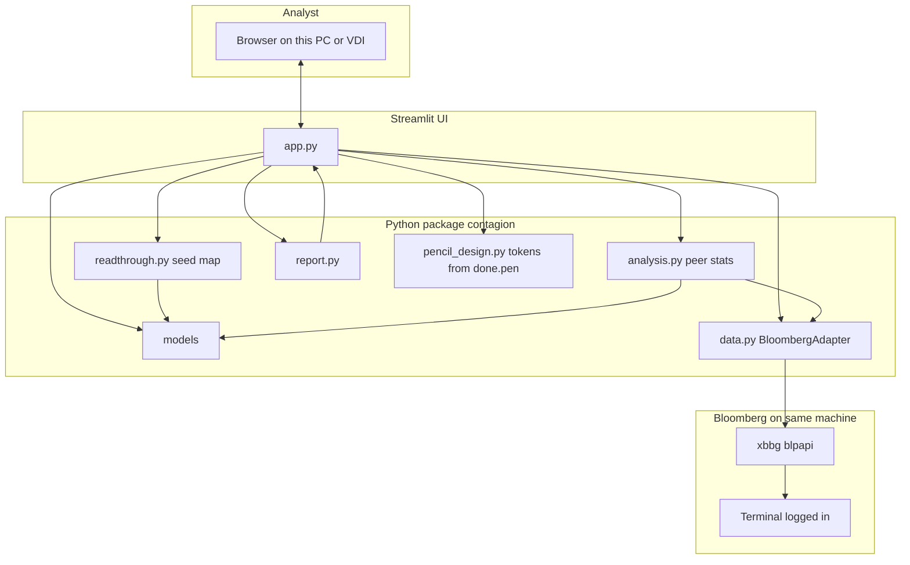
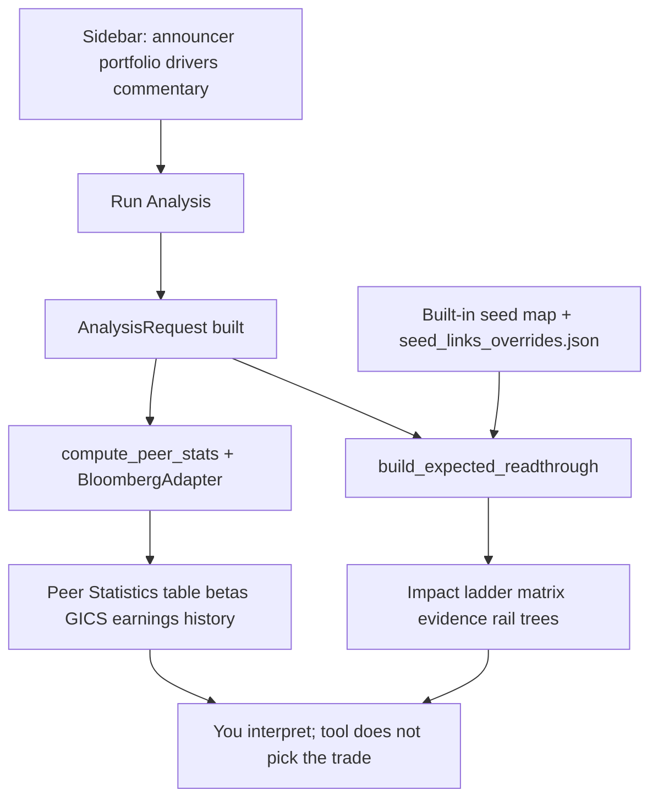

# Contagion Read-Through (Peer Read-Through)

**What this is:** A browser-based tool for equity analysts on an earnings print. It does two separate jobs in one screen:

1. **Peer statistics (Bloomberg)** — For each name in your book, it pulls real **GICS**, **betas** (vs. the announcer and vs. SPX), and **how those peers moved on the announcer’s last few earnings reaction days**. All of that comes from **Bloomberg** on the machine where you run the app.

2. **Expected read-through (rules + desk map)** — For miss drivers you select, it shows a **structured guess** of how portfolio names might read through (direction · magnitude · confidence). That part uses **fixed supply-chain relationships** (a seed map in code + optional **`seed_links_overrides.json`**), **not** live Bloomberg supply-chain AI.

You judge the trade; the app lays out **inputs and caveats**, not a single hype score.

---

## What the code is doing (plain English)

| Piece | Role |
|--------|------|
| **`app.py`** | Streamlit UI: forms, theme from `design/done.pen`, charts, tables. Orchestrates calls below. |
| **`contagion/models.py`** | Data shapes: tickers, requests, peer rows, read-through rows (with validation). |
| **`contagion/data.py`** | Talks to Bloomberg through a **`BloombergClient`** interface; **`BloombergAdapter`** turns API responses into profiles and price series. Tests use a fake client; production uses **`xbbg`** when you call `live_bloomberg_client()`. |
| **`contagion/analysis.py`** | Pure math: beta regressions, picking the earnings **reaction day**, aggregating **peer stats** — no Streamlit, no network. |
| **`contagion/readthrough.py`** | Maps **announcer → peer → relationship type** using a built-in demo map + **`seed_links_overrides.json`**, then applies **driver → relationship-type** rules for direction/magnitude. |
| **`contagion/report.py`** | Builds the **DataFrames** / chart inputs the UI displays. |
| **`contagion/pencil_design.py`** | Reads Pencil **`variables`** from `design/done.pen` for Streamlit CSS tokens. |

---

## Diagram: how the pieces connect



---

## Diagram: what happens when you click *Run Analysis*



---

## User walkthrough (first time)

1. **Open the app** — Run `streamlit run app.py` (or the **VDI** `run-streamlit.bat`). Use the URL shown (often `http://127.0.0.1:8501`).
2. **Left rail — scenario** — Enter the **announcing ticker** in Bloomberg form (`F US`, `MSFT US`, etc.). Leave **most recent earnings** checked, or set a specific date.
3. **Portfolio** — Paste **one ticker per line** (your book).
4. **Driver filters** — Pick one or more **miss drivers** (e.g. production volume). These only affect **expected read-through**, not the Bloomberg peer table.
5. **Transcript buffer (optional)** — Paste a short excerpt; it is surfaced as context text, not an NLP engine.
6. **Run Analysis** — Wait for the status steps (Bloomberg connect → peer stats → read-through build).
7. **Read top to bottom**  
   - **Expected read-through** — Chart/matrix/tree: *model* output from your drivers + desk seed map. Low-confidence rows are explicit.  
   - **Peer statistics** — *Observed* stats from Bloomberg (subject to data and sample limits).
8. **If a peer shows relationship `unknown`** — That pair is not in the seed map. Add it in **`contagion/seed_links_overrides.json`** (see below) or accept the low-confidence fallback.

---

## What it answers

> *“My announcer just printed. Which peers should I look at first, and is there any evidence they’ve moved with the announcer around past prints?”*

You keep judgment; the UI avoids a fake single “score.”

---

## Peer statistics table (Bloomberg)

| Column | Meaning |
|--------|---------|
| Ticker / Name | Peer identity |
| Sector / Industry / Sub-Industry | GICS |
| Sector / Industry Match | Overlap with announcer at that GICS level |
| Beta vs Announcer | ~252d OLS vs announcer returns |
| Beta vs SPX | ~252d OLS vs SPX (teases out market beta) |
| History Days | Days used in the beta window |
| Earnings-day mean/median | Peer return on announcer reaction days |
| Hit Rate | Same-direction frequency across those events |
| Samples | Count of usable events (≤8 by design) |
| Error | Row-level failure (sorted to bottom) |

---

## How the numbers are computed (short)

- **Beta** — OLS slope over aligned daily returns (~252 sessions); needs enough history and non-zero variance.
- **Earnings reaction day** — For each announcement `d`, the day in `[d-1, d, d+1]` with the largest \|announcer return\| (handles BMO/AMC timing).
- **Read-through** — **Not** from Bloomberg supply-chain feeds; it uses **`readthrough.py`** rules + **seed map** / overrides.

More design detail: `docs/plans/2026-05-03-peer-readthrough-design.md`.

---

## What is intentionally *not* here

- No composite 0–100 “smart score.”
- No separate database or multi-user sessions.
- **No non-Bloomberg market feed** in the Streamlit path.
- Read-through is **not** observed market reaction — copy in the app says so.

---

## Requirements

- **Python 3.11+** (avoid bleeding-edge 3.14 for `blpapi` unless your desk confirms support).
- **Bloomberg Terminal** running and logged in on **the same machine** as the app.
- **`pip install xbbg`** after `blpapi` works (firm-specific on Windows / VDI).

---

## Install and run

```powershell
pip install -r requirements.txt
pip install xbbg
streamlit run app.py
```

`xbbg` is not listed in `requirements.txt` so CI and dev machines without Terminal can still import and test with fakes.

---

## Copy-paste: find this repo and run (Terminal)

Paste from **any directory**. The script:

1. **Searches your home folder** (folders up to depth 8) for **`app.py`** inside a **git** repo that looks like this project — `origin` URL contains **`ash-project`**, or the tree has **`design/done.pen`** and **`contagion/readthrough.py`** (covers remotes removed or renamed folders).
2. If that finds nothing, uses **the current repo** (`git rev-parse`) or **walks up** from `PWD` until it sees **`app.py`** + **`contagion/`**.

Then it installs dependencies and runs Streamlit. The search can take a few seconds on a large home drive.

**macOS / Linux (bash or zsh)** — paste the whole block:

```sh
ROOT="" && \
while IFS= read -r -d '' f; do
  d="$(dirname "$f")"
  [ -d "$d/.git" ] && [ -d "$d/contagion" ] || continue
  o="$(git -C "$d" remote get-url origin 2>/dev/null || true)"
  case "$o" in *ash-project*) ROOT="$d"; break;; esac
  [ -f "$d/design/done.pen" ] && [ -f "$d/contagion/readthrough.py" ] && { ROOT="$d"; break; }
done < <(find "$HOME" -maxdepth 8 -type f -name app.py -print0 2>/dev/null) && \
if [ -z "$ROOT" ] && git rev-parse --show-toplevel >/dev/null 2>&1; then
  CAND="$(git rev-parse --show-toplevel)"
  [ -f "$CAND/app.py" ] && [ -d "$CAND/contagion" ] && ROOT="$CAND"
fi && \
if [ -z "$ROOT" ]; then
  D="$PWD"
  while [ "$D" != "/" ]; do
    if [ -f "$D/app.py" ] && [ -d "$D/contagion" ]; then ROOT="$D"; break; fi
    D="$(dirname "$D")"
  done
fi && \
if [ -z "$ROOT" ]; then
  echo "Could not find the project under $HOME (depth 8) or from here. Clone it, then re-run:"
  echo "  git clone https://github.com/grhanlon/ash-project.git"
  echo "  cd ash-project"
  exit 1
fi && \
echo "Using repo: $ROOT" && cd "$ROOT" && \
pip install -r requirements.txt && \
pip install xbbg && \
streamlit run app.py
```

**Windows (PowerShell)** — paste the whole block:

```powershell
$root = $null
$home = $env:USERPROFILE
foreach ($f in Get-ChildItem -Path $home -Recurse -Filter app.py -Depth 8 -ErrorAction SilentlyContinue) {
  $dir = $f.DirectoryName
  if (-not (Test-Path "$dir\.git")) { continue }
  if (-not (Test-Path "$dir\contagion")) { continue }
  $o = git -C $dir remote get-url origin 2>$null
  if ($LASTEXITCODE -eq 0 -and $o -match 'ash-project') { $root = $dir; break }
  if ((Test-Path "$dir\design\done.pen") -and (Test-Path "$dir\contagion\readthrough.py")) { $root = $dir; break }
}
if (-not $root) {
  $top = git rev-parse --show-toplevel 2>$null
  if ($LASTEXITCODE -eq 0 -and $top -and (Test-Path "$top\app.py") -and (Test-Path "$top\contagion")) { $root = $top }
}
if (-not $root) {
  $d = (Get-Location).Path
  while ($d) {
    if ((Test-Path "$d\app.py") -and (Test-Path "$d\contagion")) { $root = $d; break }
    $parent = Split-Path $d -Parent
    if ($parent -eq $d) { break }
    $d = $parent
  }
}
if (-not $root) {
  Write-Host "Could not find the project under $home (depth 8) or from here. Clone it, then re-run:"
  Write-Host "  git clone https://github.com/grhanlon/ash-project.git"
  Write-Host "  cd ash-project"
  exit 1
}
Write-Host "Using repo: $root"
Set-Location $root
pip install -r requirements.txt
pip install xbbg
streamlit run app.py
```

If you have **never cloned** the repo, run this once first (then use either script from the new `ash-project` folder):

```sh
git clone https://github.com/grhanlon/ash-project.git && cd ash-project
```

---

## Supply-chain seed map (`relationship` vs `unknown`)

Expected read-through needs an **announcer → peer → relationship** (e.g. `supplier`). The app ships a **small demo map** (Ford → several autos names) and merges **`contagion/seed_links_overrides.json`**. Anything else is **`unknown`** until you add a row.

**Override file shape:**

```json
{
  "links": [
    {
      "announcer": "F US",
      "peer": "TSLA US",
      "relationship_type": "supplier",
      "strength": "medium",
      "evidence": "Short note for the evidence column."
    }
  ]
}
```

Allowed **`relationship_type`:** `customer`, `supplier`, `dealer_channel`, `unknown`. **`strength`:** `low`, `medium`, `high`.  
Optional env: **`CONTAGION_SEED_LINKS_PATH`** → path to a JSON file outside the repo.

---

## Windows VDI (Bloomberg on the same VM)

1. Copy or clone the repo onto the VDI (if GitHub is blocked, use a **zip** from someone who can clone).
2. One-time: **`vdi/setup-venv.bat`** or **`powershell -ExecutionPolicy Bypass -File vdi\setup-venv.ps1`**
3. **`pip install xbbg`** per your firm’s Bloomberg/Python setup.
4. Each day: **`vdi/run-streamlit.bat`** or **`run-streamlit.ps1`**
5. In the **VDI browser:** `http://127.0.0.1:8501` (Streamlit stays on localhost; see `.streamlit/config.toml`).

---

## Other ways to run (no live Bloomberg in the cloud app)

| Target | What you get |
|--------|----------------|
| **`web/`** | Next.js + **mock** `/api/analyze`. Good for **UI demos** on Vercel. Theme reads `design/done.pen` **variables** only. |
| **`desktop/`** | PyInstaller bundle — same Streamlit app, **double-click** launcher. Still needs Terminal on that machine. |

---

## Project layout

```
app.py                    Streamlit entry
contagion/
  models.py               Requests, PeerStat, read-through types
  data.py                 Bloomberg adapter + live client
  analysis.py             Betas, reaction days, aggregator
  readthrough.py          Seed map + overrides
  report.py               Table/chart builders
  pencil_design.py        Tokens from design/done.pen
  seed_links_overrides.json
design/done.pen           Pencil design tokens
web/                      Next.js demo (Vercel)
vdi/                      Windows launchers + venv setup
desktop/                  PyInstaller spec + launcher
tests/                    Pytest (fake Bloomberg; no Terminal)
docs/plans/               Design notes
.streamlit/config.toml    Server bind + browser options
```

---

## Testing

```powershell
pytest -q
```

Tests use a **`FakeClient`**, not Bloomberg. `live_bloomberg_client()` imports `xbbg` only when called.

---

## Architecture notes

- **`BloombergAdapter`** depends on a **`BloombergClient` protocol** — swap fake vs `xbbg` without changing `analysis.py`.
- **`analysis.py`** is **pure**: `AnalysisRequest` + adapter-like object → **`AnalysisResult`**.
- **`PeerStat`** enforces: if **`error`** is set, numeric fields are **`None`**.
